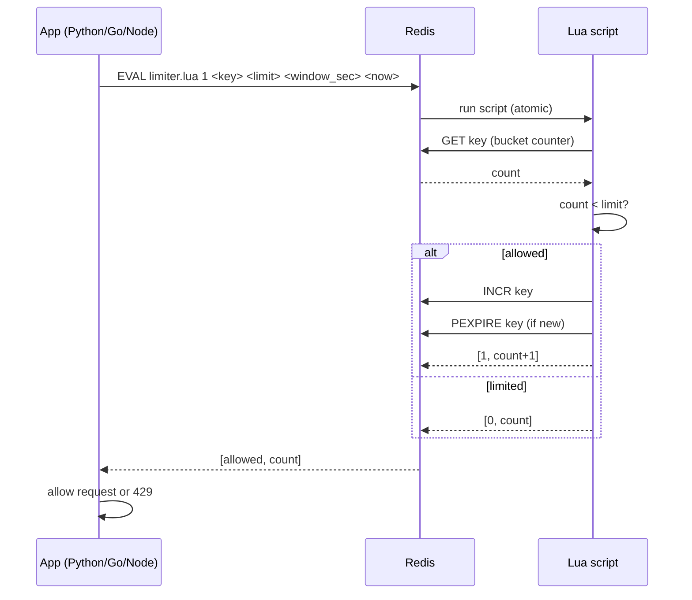
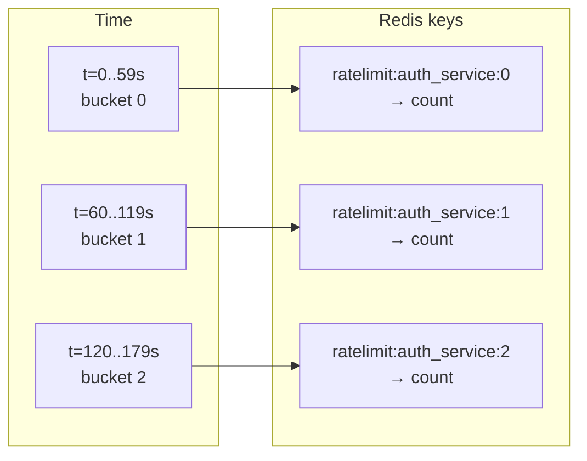
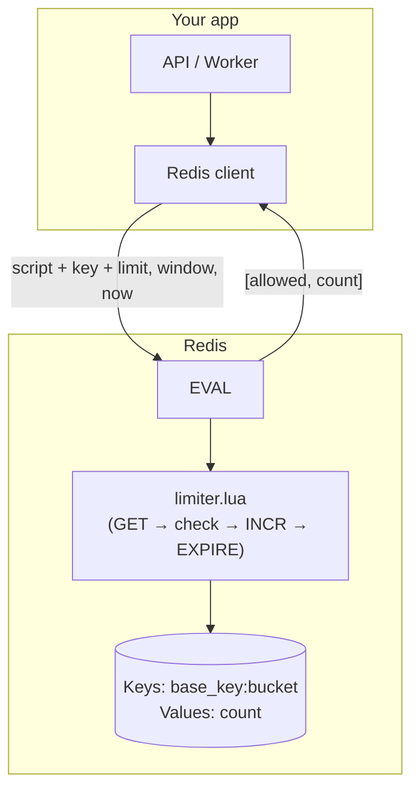

# Rate limiter – flow and architecture

## Request flow (sequence)

## Fixed-window buckets (how keys work)

- **Bucket** = `floor(now / window_sec)` → one key per time window.
- **Key** = `{base_key}:{bucket}`; value = request count in that window.
- After the window, the key expires (`PEXPIRE`) or a new bucket is used.

## Components

- **App**: loads `limiter.lua` once, calls `EVAL` per request with key and ARGV.
- **Redis**: runs the script atomically; no other command runs in between.
- **Storage**: one string key per (base_key, time bucket); value = count.
