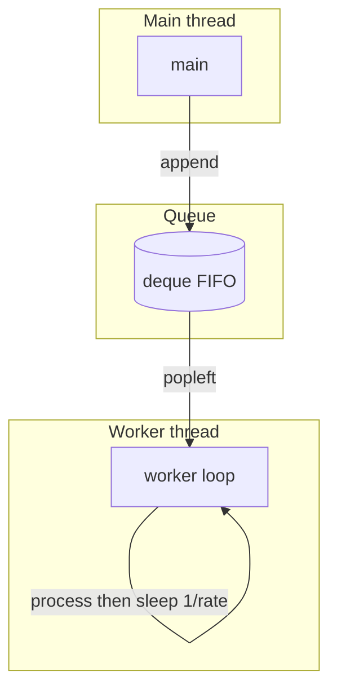
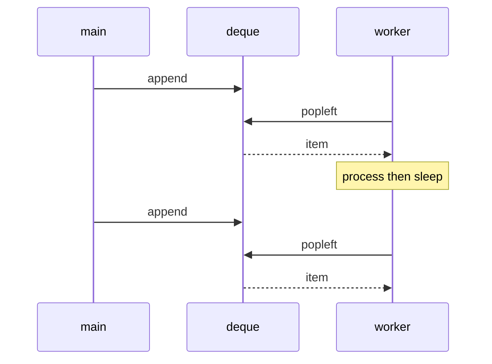

# Queue worker demo – flow

Single FIFO queue (deque) and one worker that drains at a fixed rate. No cron; the worker loop + sleep is the predictable stream.

## Data flow

- **Main** enqueues items with `queue.append(item)`.
- **deque** holds them in FIFO order; worker consumes from the left.
- **Worker** runs in a separate thread: if non-empty, `popleft()` → process → `sleep(1/rate)` → repeat. The sleep makes the drain rate predictable (e.g. 2 items/sec when `rate = 2.0`).

## Sequence (one item)

Main and worker run concurrently; the worker’s rate limits how fast items leave the queue.
